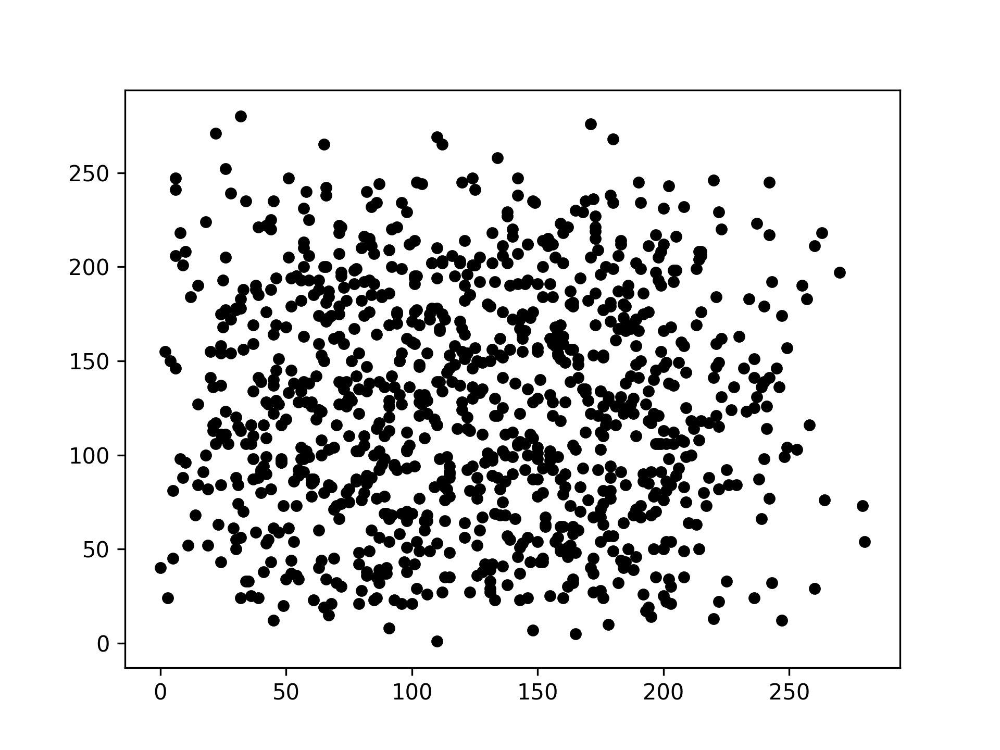
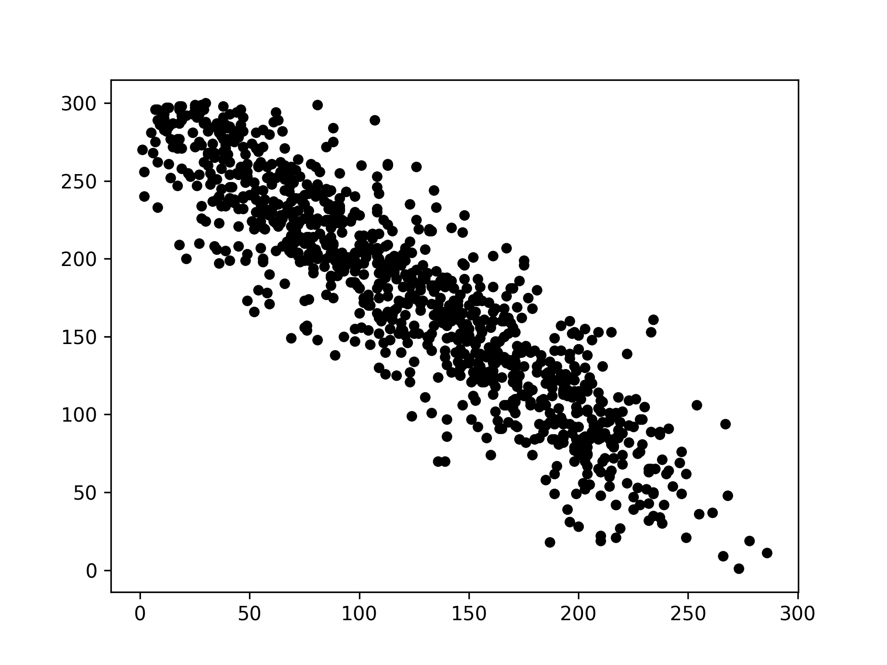
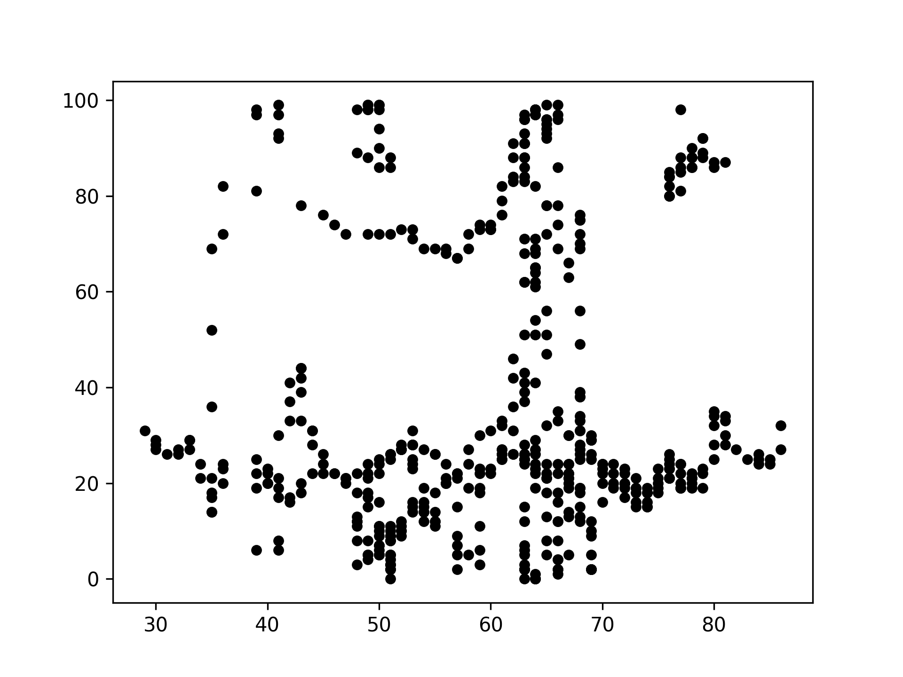

# KMPPD : k-Most Promising Products in Distributed Data

## Description 

* All codes are developed using Python 3.7.3 in macOS environment
* There are three main directories here, i.e.:
  1. **Application** : a directory that holds the core of application, i.e., classes, skyline logics, helpers, and logs.
  2. **System** : a directory that holds the core of system, i.e., simulation, data generation, graph generation, and accuracy calculation. This directory also stores database on each site for simulation purpose, included dataset, grid, RTree, and skyline results obtained, and stores any kind of graphs, such as scatterplot and  experimental results graphs. 

## How to run the simulation

### a. Creating virtual environment (optional)

1. Make sure Python 3.7, pip, and virtualenv are already installed in the machine. If it's not installed, install it first.
    ```bash
    $ python3 -V
    Python 3.7.3

    $ pip3 -V
    pip 21.1.1 from /usr/local/lib/python3.9/site-packages/pip (python 3.9)

    $ virtualenv --version
    16.5.0
    ```

2. Open the terminal and create virtual environment using `virtualenv`. **venv** is the name of virtual environment to be created. You can replace the name as you want.
    ```bash
    $ virtualenv -p python3 venv
    ```
3. Activate the created virtual environment.
    ```bash
    $ source venv/bin/activate
    ```

4. If you want to deactivate it, just do this:
    ```bash
    $ deactivate
    ```

### b. Preparation

1. Install the required packages.
    ```bash
    $ pip install -r req.txt
    ```

2. This application has an index file as the entrance to all commands. 
    ```bash
    $ python3 index.py --help 

    index.py -o <option/command> -s <number of site> -t <dataset type> -n <number of data> -d <dim size> -m <method> -k <k> -g <grid size> -x <simulation name> -p <product filename> -c <customer filename> -e <effect> -i <metric>
    ```
    Currently, there are seven kinds of command we can use: 
    * **Generate Dataset**: '`generate_dataset`'
    * **Precompute**: '`precompute`' or in another word, it is local processing
    * **Run Query**: '`run_query`'
    * **Reset Simulation**: '`reset_simulation`'
    * **Generate Line Graph**: '`generate_line_graph`' to generate experimental results graph
    * **Generate Scatterplot**: '`generate_scatterplot`' to find out the distribution of dataset
    * **Check Accuracy**: '`check_accuracy`' to check the accuracy of proposed method (under construction)


3. Firstly, we generate dataset on each site, using this command:
    ```bash
    $ python3 index.py -o generate_dataset -s <number_of_site> -t <dataset_type> -n <data_num> -d <dim_size> 
    ```

    There are 4 parameters here, i.e.
    * **Number of sites (-s)** in the distributed system to be used in the simulation.
    * **Dataset type (-t)**: There are three kinds of dataset type, i.e. 
        - Independent (**ind**)
        - Anti-correlated (**ant**)
        - Forest-covertype / real dataset (**fc**)
    * **Data size (-n)**: Number of data for each product and customer.
    * **Dim size (-d)**: Number of dimension or data attributes.

    For example, in this simulation, we generated an Independent dataset with 500 rows and 2 attributes on 3 sites.

    ```bash
    $ python3 index.py -o generate_dataset -s 3 -t ind -n 500 -d 2 
    ```

4. After dataset is generated, the database directory inside "system" will look like this.
    ```
    .
    ├── covtype.csv
    ├── site_1
    │   └── dataset
    │       ├── ind_10000_3_customer.csv
    │       └── ind_10000_3_product.csv
    ├── site_2
    │   └── dataset
    │       ├── ind_10000_3_customer.csv
    │       └── ind_10000_3_product.csv
    ├── site_3
    │   └── dataset
    │       ├── ind_10000_3_customer.csv
    │       └── ind_10000_3_product.csv
    ├── site_4
    │   └── dataset
    │       ├── ind_10000_3_customer.csv
    │       └── ind_10000_3_product.csv
    ├── site_5
    │   └── dataset
    │       ├── ind_10000_3_customer.csv
    │       └── ind_10000_3_product.csv
    ├── site_6
    │   └── dataset
    │       ├── ind_10000_3_customer.csv
    │       └── ind_10000_3_product.csv
    └── site_central
    ```

5. We generate scatter plots to illustrate the three kinds of dataset. 
    ```bash
    $ python3 index.py -o generate_scatterplot -s <site_id> -p <product_file> -c <customer_file> 
    ```
    There are 3 parameters here, i.e.
    * **Site ID (-s)**: The default site ID is 1
    * **Product file (-p)**: The filename of product dataset 
    * **Customer file (-c)**: The filename of customer dataset 

    For example:
    ```bash
    $ python3 index.py -o generate_scatterplot -s 1 -p fc_500_2_product.csv -c fc_500_2_customer.csv
    ```
    Then, we got this graph:
    * Scatter plot of Independent dataset (IND)
    
    * Scatter plot of Anti-Correlated dataset (ANT)
    
    * Scatter plot of real dataset (FC)
    

### c. Running the simulation

1. Firstly, doing the simulation of **Local Processing**, using this command:
    ```bash
    $ python3 index.py -o precompute -s <number_of_site> -t <data_type> -n <number_of_data> -d <number_of_dimension> -m <method> -g <grid_size>
    ```
    There are six parameters here, i.e.
      * **Number of sites (-s)** in the distributed system to be used in the simulation.
      * **Method (-m)**: There are three kinds of method used here, i.e. 
        - KMPPD-RiG (**kmppd**)
        - KMPPD (**naive_kmpp**)
        - Naive (**naive**)
      * **Dataset type (-t)**: There are three kinds of dataset type, i.e. 
          - Independent (**ind**)
          - Anti-correlated (**ant**)
          - Forest-covertype / real dataset (**fc**)
      * **Number of data (-c)**: Number of data for each product and customer.
      * **Number of dimension (-d)**: Number of dimension or data attributes.
      * **Grid size (-g)**: Grid size used in the data structure.

    For example:
    ```bash
    $ python3 index.py -o precompute -s 3 -t ind -n 500 -d 2 -m kmppd -g 5
    ```
2. After doing the Local Processing simulation, these three directories will be created in each site.
    ```
    .
    ├── grid
    │   ├── grid.json
    │   └── grid_info.json
    └── rtree
        ├── ...
        └── 0a07ae4a-80e3-4b7e-bfdb-14d32cc5dea6.json

    ```
    * **Grid directory** save all information about the grid created during data indexing. There are two kinds of JSON files, (1) **grid.json** save a list of product and customer data indexed in each grid column, (2) **grid_info.json** save information about the grid, including size, the boundary of each grid column, and RTree id of each grid column.
    * **RTree directory** save all RTrees created during data indexing. Each JSON file represents the RTree of each grid column, identified by a unique identifier (UUID).

3. Planning some simulation scenarios.
4. Same as Local Processing (without *option*), running the simulation of **Query Processing**, using this command:
   
    ```bash
    $ python3 distributed_system/simulation.p -s <number_of_site> -m <method> -k <k> -t <data_type> -c <cardinality> -d <dimensionality> -g <grid> 
    ```
    For example:

    ```bash
    $ python3 distributed_system/simulation.py -s 4 -m kmppd -k 30 -t ant -c 500 -d 3 -g 3
    ```
    The output will be:

    ```bash
    {
      '57_1': 2.9575428512499453,
      '119_4': 2.9215516108211212,
      '346_3': 2.9149074619001594,
      '165_1': 2.8966934065769703,
      '167_2': 2.6930601536406495,
      '450_3': 2.6476979680365282,
      '47_3': 2.6040096157791264,
      '289_2': 2.6008257930838585,
      '326_3': 2.596717592916946,
      '199_2': 2.5614447815686208,
      '313_4': 2.5608441097581847,
      '424_1': 2.4087420262342865,
      '29_3': 2.379228137927492,
      '90_2': 2.3417752998635355,
      '324_3': 2.304137270967766,
      '238_3': 2.2948859691506747,
      '380_2': 2.293724272886362,
      '199_1': 2.273622108026133,
      '7_1': 2.2731424692102444,
      '388_4': 2.22776965466594,
      '30_4': 2.226102274918064,
      '122_2': 2.210930150225479,
      '404_4': 2.183542137132795,
      '268_4': 2.1791752966675566,
      '408_3': 2.178477486565722,
      '360_4': 2.146894157613972,
      '38_3': 2.1315702271584622,
      '15_1': 2.1174541072289754,
      '439_3': 2.077500990581486,
      '64_2': 2.0722581338360717
    }
    ```
    Based on the above result example, the 30 most promising products in distributed data is Product 57 from Site 1 with market contribution score 2.95, Product 119 from Site 4 with market contribution score 2.92, and so on.

5. If you want to reset the simulation, we can do:
    ```bash
    $ python3 distributed_system/reset.py -s <simulation_name>
    ```
    For example:
    ```bash
    $ python3 distributed_system/reset.py -s naive_kmpp_ind_500_2_5
    ```

### d. Analyzing the result

1. The computation costs, i.e. runtime (S) and memory usage (MB), for each simulation is logged in `/storage/log`.
2. To generate the graph of result, we use command:
    ```bash
    $ python3 distributed_system/generate_graph.py
    1. Jumlah sites
    2. Jumlah data per site
    3. Dimensi data
    4. Jumlah grid
    5. Jumlah k
    Effect of: 1

    1. IND
    2. ANT
    3. FC
    Dataset type: 1


    3. Total Waktu Kueri
    6. Biaya Bandwith
    Metrics: 3
    /Users/mocatfrio/Scripts/kmppd/graph/jumlah_sites/total_waktu_kueri/ind_total_waktu_kueri_jumlah_sites.png is exported succesfully!
    ```
3. Analyzing the generated graph.

### e. Check accuracy

```bash
$ python3 distributed_system/check_accuracy.py -s <site_id> -p <product_file> -c <customer_file> -g <grid_size> -m <method>
```
For example:
```bash
$ python3 distributed_system/check_accuracy.py -s 1 -p ind_500_2_product.csv -c ind_500_2_customer.csv -g 5 -m naive
```


